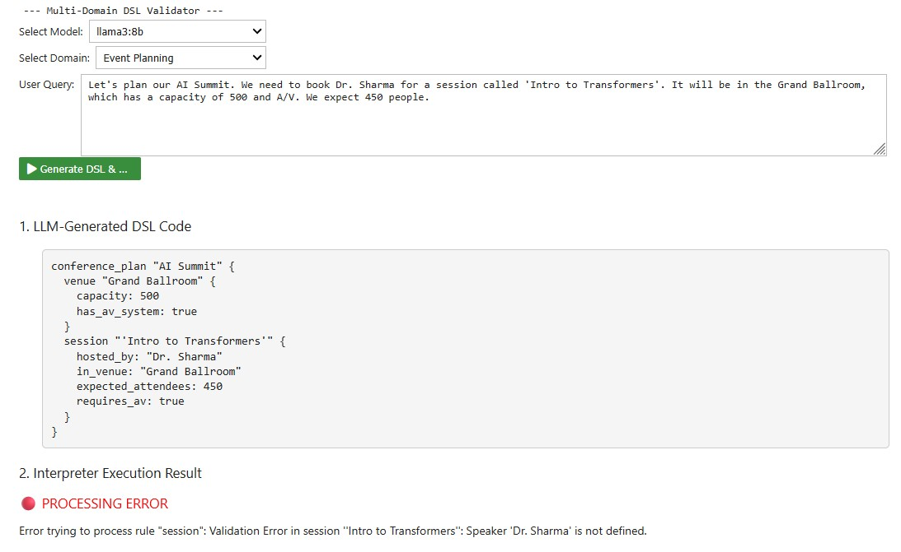

# LLM-Powered DSL Validator

This project explores an framework for building reliable, rule-based applications powered by Large Language Models (LLMs). It aims to leverage an LLM for its natural language understanding while using a deterministic, custom-built interpreter as a "source of truth" for enforcing critical domain-specific rules.

## The Story: Why Constrain an LLM?

Large Language Models are quite effective at interpreting human language. We can ask a model to plan a bike ride or calculate a bill, and it will often produce a correct answer. However, LLMs lack a deep, verifiable understanding of specific business rules and constraints. They might confidently make assumptions that are incorrect or unsafe in a given context.

This system demonstrates how a Domain-Specific Language (DSL) and a custom interpreter can act as a **semantic firewall**, ensuring that the LLM's output conforms to a set of hard-coded rules.

Consider these scenarios, which this system is designed to handle:

1.  **User Error:** A user asks the restaurant bot, `"I'll have the steak for €15."`
    * The LLM correctly translates this into the DSL.
    * However, an interpreter written with the knowledge of the restaurant expert (subject matter expert) knows steak is not on the menu. The request is rejected, not because the language was misunderstood, but because it violated a fundamental business rule.

2.  **LLM misunderstanding:** A user tells the event planning bot, `"Schedule a 'Deep Dive' workshop in Workshop Room A for 30 people. It needs A/V."`
    * This is a perfectly reasonable request. The LLM generates a syntactically valid DSL plan.
    * But an interpreter that has been programmed with expert knowledge: **Workshop Room A does not have an A/V system** will cross-reference the session's requirements with the venue's capabilities and invalidates the plan, preventing a real-world booking error.

In essence, the motivation: the DSL interpreter doesn't just check syntax; it validates the *meaning* and *implications* of the request against a trusted model of the domain.

---

## System Overview

1.  **Translation:** An LLM (in this case chosen by the user) takes a conversational, unstructured user query and translates it into a formal, structured representation using our custom DSLs. For more complex domains like event planning, this is done by having the LLM extract entities into a JSON object, which is then programmatically assembled into the final DSL.
2.  **Interpretation:** A custom interpreter, written in Python using the [Lark](https://lark-parser.readthedocs.io/en/stable/) parsing library, executes the DSL code, enforcing the domain's business logic.

---

## Usage Instructions

The application interface in the Jupyter Notebook is straightforward.



1.  **Select Model:** Use the first dropdown to choose which Ollama model to use for generating the DSL. The list is populated automatically from your running Ollama server.
2.  **Select Domain:** Use the second dropdown to choose the business domain (e.g., Tax Calculation, Event Planning). This changes the example query and the underlying DSL/interpreter that will be used.
3.  **Enter User Query:** The text area is pre-filled with an example query for the selected domain. You can edit this or write your own from scratch.
4.  **Generate & Execute:** Click this button to start the process.
5.  **Output Area:** The results appear below the button.
    * **LLM-Generated DSL Code:** This section shows the raw DSL code that the selected model generated from your query.
    * **Interpreter Execution Result:** This section shows the outcome. It will either be a success message with the calculated results or a red error message if the DSL failed the interpreter's validation rules.

---

## How to Run

### 1. Prerequisites: Install Ollama

This demo requires a running Ollama server.

1.  **Install Ollama:** Download from <https://ollama.com>.
2.  **Download Models:** Open a terminal and run `ollama pull <model_name>` for each model you want to test. At a minimum, you will need `llama3:8b`.
    ```bash
    ollama pull llama3:8b
    ollama pull mistral
    ```

### 2. Setup the Python Environment

The demo is a Jupyter Notebook.

1.  **Navigate to the Project Folder:**
    ```bash
    cd LLM_DSL_VALIDATOR
    ```
2.  **Create and Activate a Virtual Environment:**
    ```bash
    python -m venv venv
    # On Windows (PowerShell)
    .\venv\Scripts\Activate.ps1
    # On macOS/Linux
    source venv/bin/activate
    ```
    *(Note: On PowerShell, you may first need to run `Set-ExecutionPolicy -ExecutionPolicy RemoteSigned -Scope Process`)*

3.  **Install Dependencies:**
    ```bash
    pip install -r requirements.txt
    ```

### 3. Launch the Notebook

1.  **Start the Jupyter Server:**
    ```bash
    jupyter notebook
    ```
2.  **Run the Demo:** Open `notebooks/demo.ipynb` in your browser and execute the cells in order.

---


## Example DSLs and Interpreters

The grammars are defined in `.dsl` files and the logic is implemented in corresponding Python interpreters.

**1. Tax Calculation (`src/domains/tax/`)**
* **Grammar (`grammar.dsl`):** Defines a `bill` containing line `items` with quantities and prices.
* **Interpreter (`interpreter.py`):** The `BillInterpreter` categorizes items into food or drink and applies different tax rates (7% for food, 19% for drink).
* *Example DSL Code:*
    ```dsl
    bill {
      burger: 3 * 10
      soda: 2 * 3
    }
    ```


**2. Cycling Planner (`src/domains/cycling/`)**
* **Grammar (`grammar.dsl`):** Defines a `ride` with properties like `terrain` and `distance_km`.
* **Interpreter (`interpreter.py`):** The `RideInterpreter` calculates an estimated ride duration based on average speeds for different terrain types.
* *Example DSL Code:*
    ```dsl
    ride {
      terrain: mountainous
      distance_km: 200
    }
    ```


**3. Event Planning (`src/domains/event/`)**
* **Grammar (`grammar.dsl`):** Defines a `conference_plan` containing `venue`, `speaker`, and `session` resources.
* **Interpreter (`interpreter.py`):** The `EventInterpreter` validates the plan by cross-referencing session requirements against venue capabilities (e.g., capacity, A/V availability).
* *Example DSL Code:*
    ```dsl
    conference_plan "AI Summit" {
      venue "Workshop Room A" {
        capacity: 40
        has_av_system: false
      }
      session "Deep Dive into NLP" {
        in_venue: "Workshop Room A"
        expected_attendees: 35
        requires_av: true
      }
    }
    ```

---

## How to extend code and contribute

The project is structured to make adding new domains fairly straightforward.

### Code Structure

The source code is organized into a `framework` for the core and a `domains` package that holds each self-contained domain(grammars and interpreters).

```
src/
├── core.py               # Main logic, prompts, and LLM interaction
├── framework/
│   └── base_interpreter.py # The base class for all interpreters
└── domains/
    ├── tax/
    │   ├── grammar.dsl
    │   └── interpreter.py
    ├── cycling/
    │   └── ...
    └── event/
        └── ...
```

### How to Extend with a New Domain

For writing interpreters, use Lark documentation(linked above).

To add a new domain (e.g., "Bookings"):

1.  **Create the Domain Package:** Create a new folder `src/domains/booking/`. Add an empty `__init__.py` file inside it.
2.  **Define the Grammar:** Create `src/domains/booking/grammar.dsl` with your new language rules.
3.  **Implement the Interpreter:** Create `src/domains/booking/interpreter.py`. The class inside should inherit from `BaseInterpreter` and implement methods to transform your DSL's grammar rules.
4.  **Hook into Core Logic:** In `src/core.py`, import your new interpreter and create a new `process_booking_request` function that defines a prompt and calls the appropriate processing helper (`_process_request` or `_process_with_json_assembler`).
5.  **Update the UI:** In `demo.ipynb`, add the new domain to the `Dropdown` options, include example queries, and add a new `elif` block to call your `process_booking_request` function.

---

## Next Steps

* **Implement the Chatbot Loop:** Create the feedback loop where interpreter errors are sent back to the LLM to generate helpful, clarifying questions for the user (motivation below).
* **Incorporate a Proper Front End:** Replace the Jupyter Notebook with a web-based UI using a framework like React or Vue.
* **Centralize the Backend:** Host the Python backend and the Ollama server in a central location to be accessed by the front end.
* **Evolve the DSLs:** Continue to add complexity and rules to the existing DSLs to handle more sophisticated scenarios.

### Useful as inputs for LLMs

This validation could later be when used to guide the conversation. Instead of simply returning an error, a future version of this system could feed the interpreter's validation message back to the LLM.

* **Interpreter Error:** `Validation Error: Session 'Deep Dive' requires A/V, but venue 'Workshop Room A' does not have an A/V system.`
* **LLM's New Prompt:** `The user's plan failed with the error: "Workshop Room A has no A/V system." Formulate a helpful response and suggest an alternative.`
* **Chatbot's Reply to User:** `"It looks like Workshop Room A doesn't have the A/V equipment needed for your session. The Grand Ballroom does have a full A/V system. Would you like to book that room instead?"`

