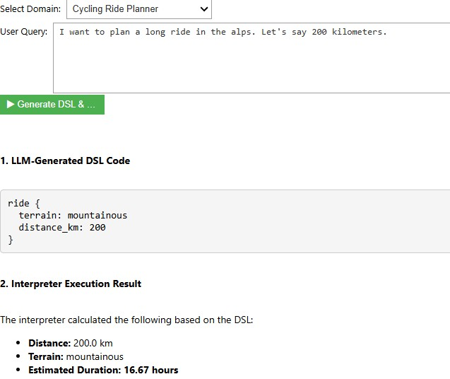

# LLM to DSL Validator

A system that uses a custom-built Domain-Specific Language (DSL) and interpreter to enforce business logic on the output of a Large Language Model (LLM).

Goal is to leverage an LLM for its natural language understanding capabilities while using a deterministic, custom-built interpreter for critical business rules.

## System 

1.  **Translation:** An LLM (in this case Llama 3) takes a conversational, unstructured user query and translates it into a formal, structured representation using our custom-built DSLs.
2.  **Interpretation:** A custom interpreter, written in Python using the Lark parsing library, executes the DSL code.

---

## How to run

### 1. Prerequisites: Install Ollama

This demo requires a running Ollama server.

1.  **Install Ollama:** Download from <https://ollama.com>.
2.  **Download the Model:** Open a terminal and run:
    ```bash
    ollama pull llama3:8b
    ```

### 2. Setup the Python Environment (Install [Python](https://www.python.org/downloads/) if needed )

The demo is a Jupyter Notebook.

1.  **Navigate to the Project Folder:**
    ```bash
    cd llm_dsl_validator
    ```
2.  **Create and Activate a Virtual Environment:**
    ```bash
    python -m venv venv
    .\venv\Scripts\Activate.ps1
    ```
    *(Note: On PowerShell, you may first need to run `Set-ExecutionPolicy -ExecutionPolicy RemoteSigned -Scope Process`)*

3.  **Install Dependencies:**
    ```bash
    pip install -r requirements.txt
    ```

### 3. Launch the Notebook

1.  **Start the Jupyter Server:**
    ```bash
    jupyter notebook
    ```
2.  **Run the Demo:** Open `notebooks/demo.ipynb` in your browser and execute the cells in order.

---

## Implementation Details

There are two small DSLs from the cycling and tax calculation domains. 

### The Custom DSLs

The grammars are defined in `.dsl` files using the [Lark](https://github.com/lark-parser/lark) syntax.

**1. Tax Calculation Grammar (`tax_rules.dsl`):**
```
// Grammar for our Tax Calculation DSL
start: bill
bill: "bill" "{" items "}"
items: item+
item: CNAME ":" NUMBER "*" NUMBER -> line_item_with_quantity
    | CNAME ":" NUMBER           -> line_item_simple

%import common.CNAME
%import common.NUMBER
%import common.WS
%ignore WS
```

*Example DSL Code (Generated by LLM):*
```
bill {
  burger: 2 * 10
  soda: 3
}
```


**2. Cycling Planner Grammar (`cycling_planner.dsl`):**
```
// Grammar for Cycling Ride Planner DSL
start: ride
ride: "ride" "{" properties "}"
properties: property+
property: CNAME ":" (CNAME | NUMBER) -> prop_line

%import common.CNAME
%import common.NUMBER
%import common.WS
%ignore WS
```

*Example DSL Code (Generated by LLM):*
```
ride {
  terrain: hilly
  distance_km: 50
}
```



### Interpreters

The interpreters, located in `src/interpreters/`, are Python classes that implement the Lark's `[Transformer](https://lark-parser.readthedocs.io/en/latest/visitors.html)` interface. They walk the parse tree generated by Lark and execute business logic.

* **`BillInterpreter`** (`tax_interpreter.py`): This interpreter processes a restaurant bill. It categorizes items into "food" or "drink" based on keywords(hardcoced for now) and applies fixed tax rates (7% for food, 19% for drink) to calculate the final total.
* **`RideInterpreter`** (`cycling_interpreter.py`): This interpreter processes a bike ride plan. It calculates an estimated ride duration based on the provided `distance_km` and `terrain` (flat, hilly, or mountainous), using a set of average speeds for each terrain type.

### The LLM Prompts

**1. Tax Calculation Prompt:**
```python
prompt = """You are a helpful assistant that translates natural language into a custom DSL.
The DSL format is:
bill {{
  itemName: quantity * pricePerItem
  anotherItemName: price
}}
Translate the following user order into this DSL. The item names should be simple, lowercase words like 'burger' or 'soda'.
User Order: "{user_query}"
DSL Response:"""
```


**2. Cycling Planner Prompt:**
```python
prompt = """You are a helpful assistant that translates natural language into a custom DSL for planning a bike ride.
The DSL format is:
ride {{
  terrain: flat | hilly | mountainous
  distance_km: number
}}
Translate the following user request into this DSL. The 'terrain' value must be an unquoted word.
User Request: "{user_query}"
DSL Response:"""
```

---

## Next steps

* Incorporate a proper front end: React/ Vue based?
* Centralize the Ollama server: Host the backend in a central server
* Evolve the DSLs
