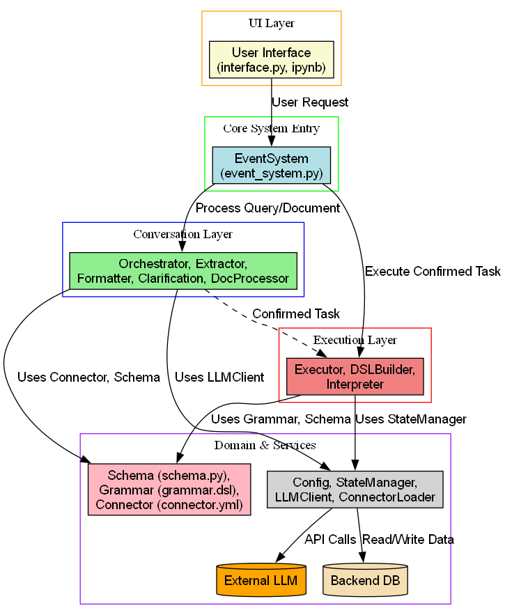
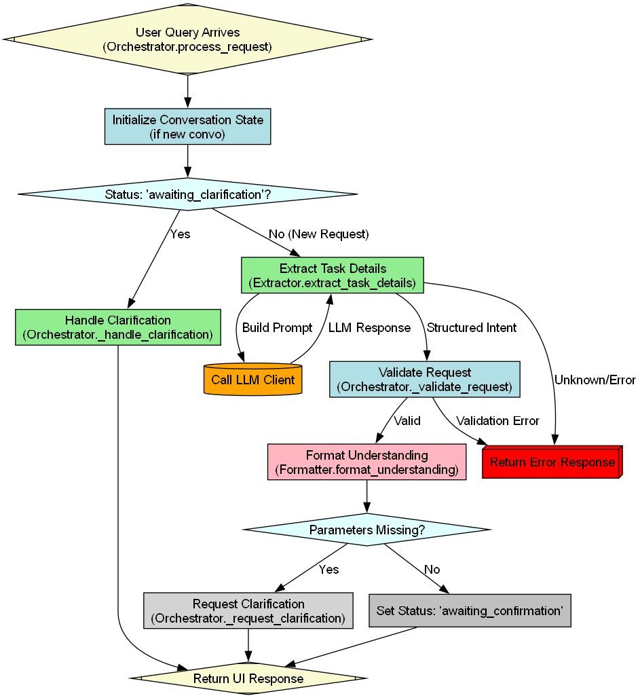
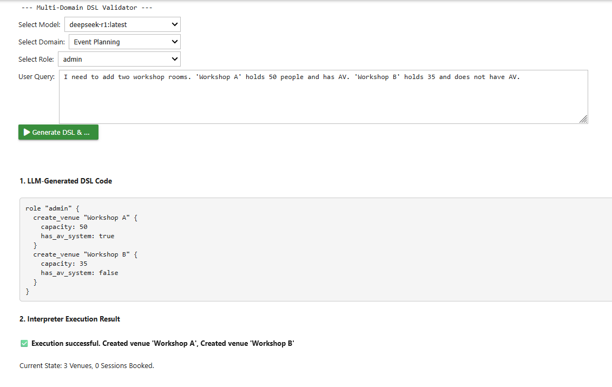
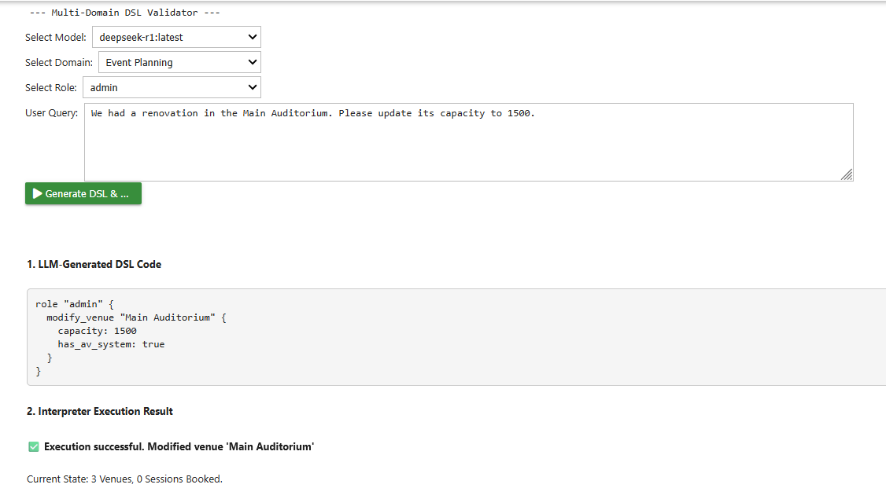
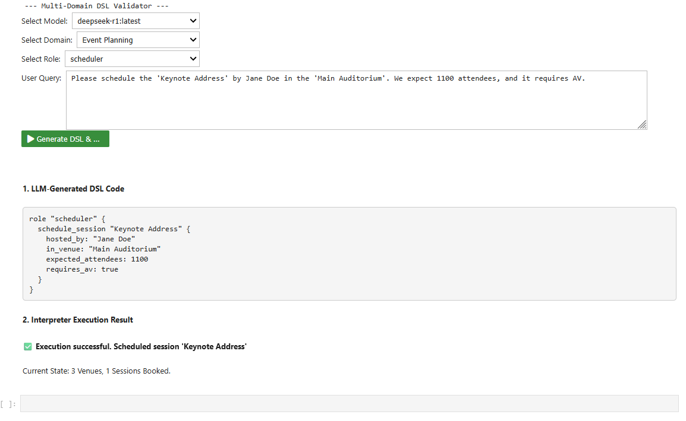
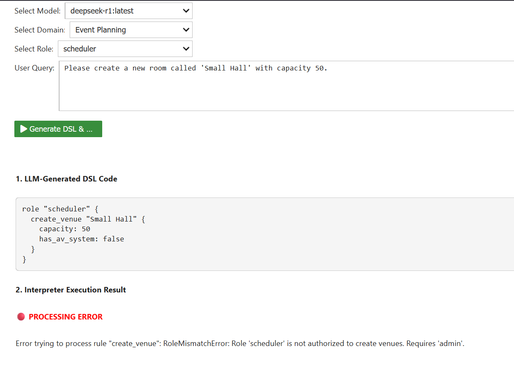
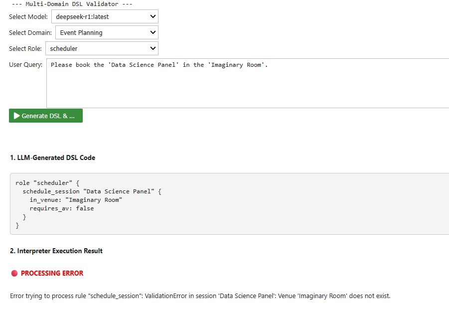
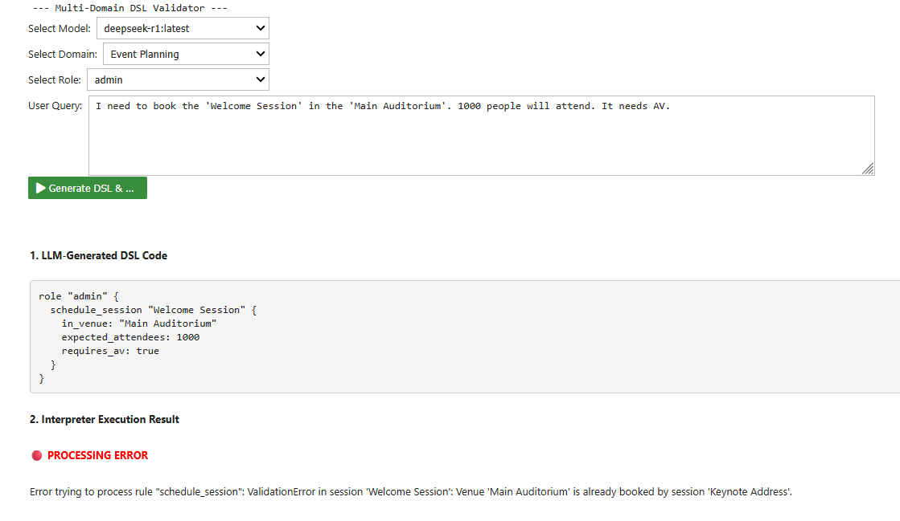
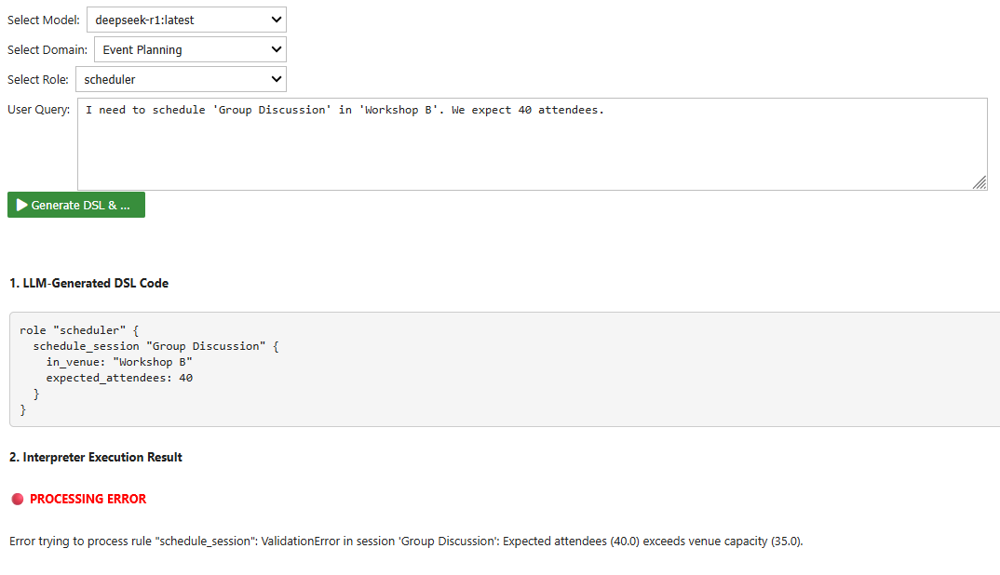
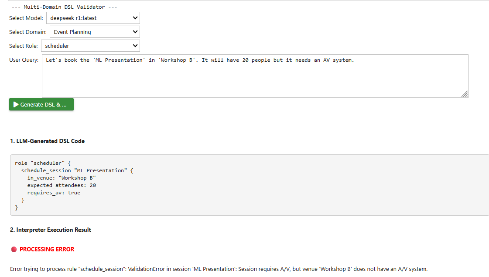

# LLM-Powered DSL Framework

This project is a framework for building reliable, rule-based applications that use a Large Language Model (LLM) for natural language understanding. The core principle is to leverage an LLM for its powerful language parsing capabilities while using a deterministic, custom-built interpreter to enforce critical, domain-specific rules.

## The Semantic Firewall Concept

While LLMs are effective at interpreting human language, they lack a verifiable understanding of specific business rules and constraints. They might confidently hallucinate answers or make unsafe assumptions. This framework uses a Domain-Specific Language (DSL) and a custom interpreter to act as a **semantic firewall**, ensuring that the LLM's output conforms to a set of hard-coded, verifiable rules before any action is taken.

The DSL interpreter doesn't just check syntax; it validates the *meaning* and *implications* of a request against a trusted model of the domain. For example:

* An LLM might correctly understand a request to schedule a 30-person meeting in "Workshop Room A".
* However, a stateful interpreter, programmed with expert knowledge, knows that "Workshop Room A" has a maximum capacity of 20. It will reject the command, not because the language was misunderstood, but because it violated a fundamental business rule.

---

## System Architecture

The framework is designed with a modular, layered architecture to separate concerns. This makes the system extensible, allowing new domains and DSLs to be added primarily through configuration rather than extensive code changes.

1.  **UI Layer:** The user-facing component (e.g., a Jupyter Notebook) that captures user input and displays conversation history.
2.  **Conversation Layer:**  It uses an **Orchestrator** to manage the conversation flow. It leverages an **Extractor** (powered by an LLM) to turn natural language into a structured command, a **Clarifier** to ask for missing information, and a **Formatter** to generate UI messages.
3.  **Execution Layer:** Once a command is confirmed, control is shifted to the execution layer. A **DSL Builder** converts the structured command into a formal DSL string. This string is then parsed and executed by a domain-specific **Interpreter**.
4.  **Domain Definition:** A new domain is defined by providing three key files:
    * `connector.yml`: Provides natural language descriptions for the LLM.
    * `schema.py`: Defines the formal structure, permissions, and DSL syntax of the domain.
    * `grammar.dsl`: Defines the formal grammar for the DSL parser.

---

## How to Run the Demo

### 1. Prerequisites: Install Ollama

A running Ollama server is required for local model inference.

1.  **Install Ollama:** Download from <https://ollama.com>.
2.  **Download a Model:** In a terminal, run `ollama pull llama3:8b`.

### 2. Optional: Configure Together AI

For faster performance, you can use remote models from Together AI.

1.  **Get an API Key:** Sign up at <https://www.together.ai/>.
2.  **Store Your API Key:** Copy the `.env.example` file to a new file named `.env`. Open `.env` and paste your API key. The `.env` file is included in `.gitignore`, so your key will remain private.
3.  **Select a Model:** The UI dropdown will include `togetherai/` models. Choosing one will use the remote API.

### 3. Setup the Python Environment

1.  Navigate to the project folder and create a virtual environment.
2.  Install dependencies: `pip install -r requirements.txt`.

### 4. Launch the Notebook

1.  Start the Jupyter Server: `jupyter notebook`
2.  Open `notebooks/event_chatbot_simplified.ipynb` and run the cells to start the chat interface.

---

## How to Extend the Framework with a New DSL

The framework is designed to be easily extended. To add a new domain (e.g., "Inventory Management"), you would follow this recipe:

1.  **Create a `connector.yml` file:** Define your new actions (e.g., `add_item`) and parameters (e.g., `item_name`, `quantity`) with user-friendly descriptions and clarification prompts for the LLM.
2.  **Create a `schema.py` file:** Define the formal structure for your new actions. Specify required parameters, permissions, and, most importantly, the `dsl_syntax` and `dsl_keyword` metadata that the generic `DSLBuilder` will use.
3.  **Create a `grammar.dsl` file:** Write the formal Lark grammar for your new DSL's syntax.
4.  **Write a new `Interpreter` class:** This is the main piece of new code required. Create a class like `InventoryInterpreter` that inherits from `BaseInterpreter`. Implement methods with names that match your grammar rules (e.g., an `add_item` method) to contain the execution logic.
5.  **Wire it into the system:** Update the main system coordinator to load the configuration and interpreter for your new domain.

---

## Example Domain: Event Management

The primary example is for managing a conference. It demonstrates Role-Based Access Control (RBAC), a conversational interface for handling incomplete requests, and strict rule enforcement.

#### Admin Command: `create_venue`
Allows an **admin** to add a new room.

#### Admin Command: `modify_venue`
Allows an **admin** to change a venue's properties.

#### Admin & Scheduler Command: `schedule_session`
Used by both roles to book a session.

#### The Interpreter as a "Semantic Firewall"
The interpreter rejects commands that are syntactically correct but logically invalid according to the domain's rules.

**Role Mismatch:** A `scheduler` attempts an admin-only action.

**Venue Must Exist:** A user tries to book a session in an "Imaginary Room".

**No Double Booking:** A user tries to book a session in an already-booked venue.

**Capacity Check:** A booking for 40 people is attempted in a room with a capacity of 35.

**A/V System Check:** A user requests an A/V system in a room that doesn't have one.

---

## Next Steps

* **Implement a Dynamic Domain Loader:** Improve the system coordinator to dynamically load the correct domain's configuration based on user input.
* **Enhance the Feedback Loop:** Send interpreter errors back to the LLM to generate more context-aware, helpful responses to the user.
* **Evolve the DSLs:** Continue to add complexity and rules to handle more sophisticated scenarios.
