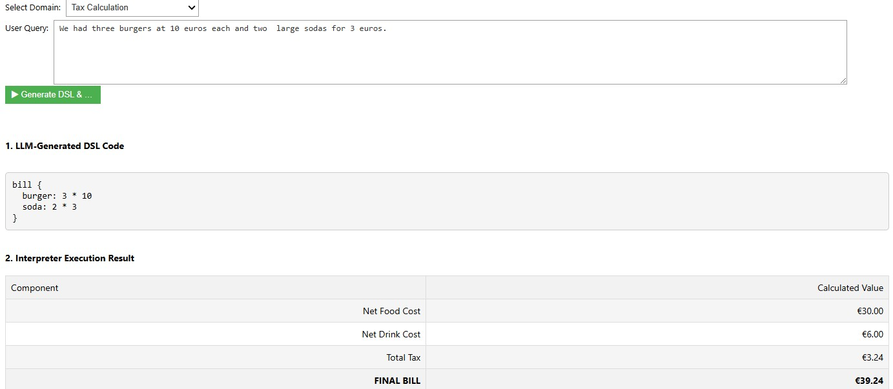

# LLM-Powered DSL Validator

This project explores a framework for building reliable, rule-based applications powered by Large Language Models (LLMs). It aims to leverage an LLM for its natural language understanding while using a deterministic, custom-built interpreter as a "source of truth" for enforcing critical domain-specific rules.

## Why Constrain an LLM?

Large Language Models are quite effective at interpreting human language. We can ask a model to plan a bike ride or calculate a bill, and it will often produce a correct answer. However, LLMs lack a deep, verifiable understanding of specific business rules and constraints. They might confidently make assumptions that are incorrect or unsafe in a given context.

This system demonstrates how a Domain-Specific Language (DSL) and a custom interpreter can act as a **semantic firewall**, ensuring that the LLM's output conforms to a set of hard-coded rules.

Consider these scenarios, which this system is designed to handle:

1.  **User Error:** A user asks the restaurant bot, `"I'll have the steak for €15."`
    * The LLM correctly translates this into the DSL.
    * However, an interpreter written with the knowledge of the restaurant expert knows steak is not on the menu. The request is rejected, not because the language was misunderstood, but because it violated a fundamental business rule.

2.  **LLM Misunderstanding:** A user tells the event planning bot, `"Schedule a 'Deep Dive' workshop in Workshop Room A for 30 people. It needs A/V."`
    * This is a perfectly reasonable request. The LLM generates a syntactically valid DSL plan.
    * But an interpreter that has been programmed with expert knowledge—**Workshop Room A does not have an A/V system**—will cross-reference the session's requirements with the venue's capabilities and invalidate the plan, preventing a real-world booking error.

In essence, the motivation is this: the DSL interpreter doesn't just check syntax; it validates the *meaning* and *implications* of the request against a trusted model of the domain.

---

## System Overview

1.  **Translation:** An LLM takes a conversational, unstructured user query and translates it into a formal, structured representation using our custom DSLs.
2.  **State Management:** For complex domains like Event Planning, the system is **stateful**. It loads the current state of the domain from a JSON file before processing a request.
3.  **Interpretation & Validation:** A custom Python interpreter executes the DSL code. This interpreter is the "source of truth," enforcing all business logic, rules, and user permissions.
4.  **State Persistence:** If the interpreter validates the command successfully, any changes to the state are saved back to the JSON file, persisting them for the next interaction.

---

## Usage Instructions

The application interface in the Jupyter Notebook is straightforward.


1.  **Select Model:** Choose which Ollama model to use for generating the DSL.
2.  **Select Domain:** Choose the business domain (e.g., Tax Calculation, Event Planning).
3.  **Select Role (if applicable):** For domains like Event Planning, a role selector will appear.
4.  **Enter User Query:** Write your request in natural language.
5.  **Generate & Execute:** Click the button to run the process.
6.  **Output Area:** The results appear below, showing the generated DSL and the success or failure message from the interpreter.

---

## How to Run

### 1. Prerequisites: Install Ollama

This demo requires a running Ollama server.

1.  **Install Ollama:** Download from <https://ollama.com>.
2.  **Download Models:** Open a terminal and run `ollama pull <model_name>` for each model you want to test (e.g., `llama3:8b`).

### 2. Setup the Python Environment

1.  Navigate to the project folder and create a virtual environment.
2.  Install dependencies: `pip install -r requirements.txt`

### 3. Launch the Notebook

1.  Start the Jupyter Server: `jupyter notebook`
2.  Run the Demo: Open `notebooks/demo.ipynb` and execute the cells.

---

## Example Domains

The grammars are defined in `.dsl` files and the logic is implemented in corresponding Python interpreters.

### Stateless Domains

These are simple, one-shot commands that don't rely on past interactions.

**1. Tax Calculation (`src/domains/tax/`)**
* **Interpreter:** Categorizes items into food or drink and applies different tax rates.
* **Example DSL Code:**
    ```dsl
    bill {
      burger: 3 * 10
      soda: 2 * 3
    }
    ```


**2. Cycling Planner (`src/domains/cycling/`)**
* **Interpreter:** Calculates an estimated ride duration based on average speeds for different terrain types.
* **Example DSL Code:**
    ```dsl
    ride {
      terrain: mountainous
      distance_km: 200
    }
    ```


---

### Stateful Domain: Event Management

This is the most advanced domain, demonstrating statefulness and Role-Based Access Control (RBAC). It simulates managing a conference by creating venues and scheduling sessions, with a strict set of rules enforced by the interpreter.

#### Core Concepts

* **Stateful Persistence**: The "state" of the conference—all the venues that exist and all the sessions that are booked—is stored in a `state.json` file. This creates a persistent, evolving model of the conference that can be modified over multiple interactions.
* **Role-Based Access Control (RBAC)**: To control who can do what, the system implements two user roles:
    * **`admin`**: Full permissions. Can create/modify venues and schedule sessions.
    * **`scheduler`**: Limited permissions. Can only schedule sessions in existing venues.

#### Understanding the DSL and its Commands

The LLM translates your natural language into a simple but powerful DSL. The interpreter then executes this DSL, enforcing the rules.

**Admin Command: `create_venue`**

Allows an **admin** to add a new room to the conference.

*Example: Creating a single room.*


*Example: Creating multiple rooms in a single command.*


**Admin Command: `modify_venue`**

Allows an **admin** to change the properties of an existing venue.

*Example: Updating a venue's capacity.*


**Admin & Scheduler Command: `schedule_session`**

Used by both roles to book a session. The interpreter validates this command against several rules.

*Example: A scheduler successfully books a session in a valid room.*


**Combined Commands**

The system can handle multiple actions in a single request.

*Example: An admin creates a new venue and immediately schedules a session in it.*


#### The Interpreter as a "Semantic Firewall"

The interpreter rejects commands that are syntactically correct but logically invalid.

**Validation Rule: Role Mismatch**

*Example: A scheduler attempts to create a venue (an admin-only action).*


**Validation Rule: Venue Must Exist**

*Example: A user tries to book a session in an "Imaginary Room".*


**Validation Rule: No Double Booking**

*Example: A user tries to book a session in an already-booked venue.*


**Validation Rule: Capacity Check**

*Example: A user tries to book 40 people into a room with a capacity of 35.*


**Validation Rule: A/V System Check**

*Example: A user requests an A/V system in a room that doesn't have one.*


---

## How to Extend Code

The project is structured to make adding new domains straightforward. To add a new domain, you would:
1.  Add the new command to the grammar (`.dsl` file).
2.  Implement the corresponding method in the interpreter (`.py` file), including validation logic.
3.  Update the core prompt in `src/core.py` to teach the LLM the new command.
4.  Update the UI in `demo.ipynb` if any new inputs are required.

---

## Next Steps

* **Implement the Chatbot Loop:** Create a feedback loop where interpreter errors are sent back to the LLM to generate helpful, clarifying questions for the user.
* **Incorporate a Proper Front End:** Replace the Jupyter Notebook with a web-based UI.
* **Evolve the DSLs:** Continue to add complexity and rules to handle more sophisticated scenarios.
